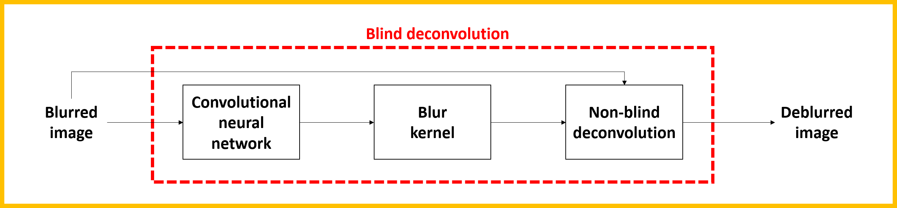
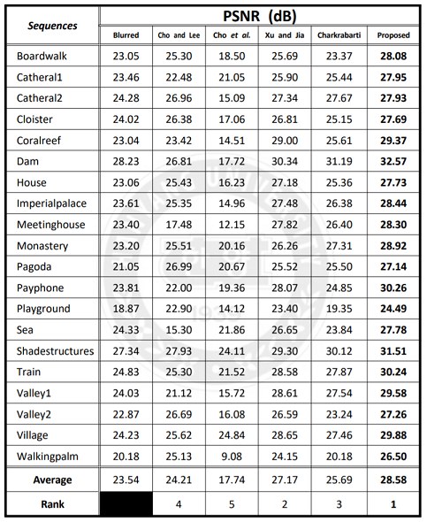
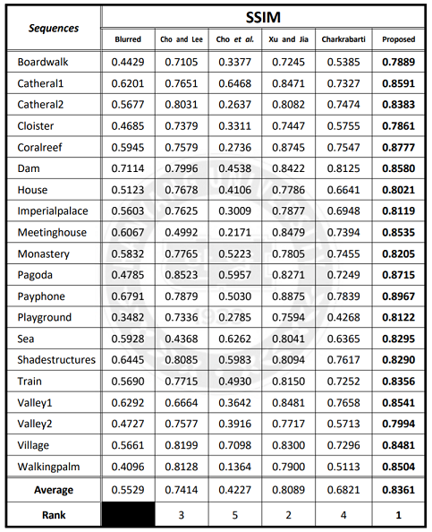

# Project_DeblurCNNv0.3
Minso Jeong, Master's thesis (2018.09 ~ 2018. 12)

Uniform Motion Blur Removal Algorithm with a Single Image using Convolutional Neural Network :

>[**Uniform Motion Blur Removal Algorithm with a Single Image using Convolutional Neural Network**](https://lib.hanyang.ac.kr/#/search/detail/18346054)   
>Minso Jeong    
>한양대학교 대학원  

Contact : [minso.jeong@daum.net](mailto:minso.jeong@daum.net)

## Updates

## Abstract
Image blur that occurs when a digital camera is used for photographing is one of the main causes of image degradation. The main causes of image blur are out-focusing, movement of objects and camera shake. Among them, camera shake is included in motion blur. Motion blur occurs when taking pictures in low light conditions. If the blur occurs, you can obtain the image by retaking. However, it is impossible to retake certain moments such as live broadcasts. So it should be solved by using image deblurring technique. To do this, we propose the algorithm to remove the uniform motion blur that is blurred in the same form for all pixels in a single image.

In this thesis, we propose the algorithm to remove uniform motion blur of a single image using convolutional neural network (CNN) that reconstructs the edge of the image clearly. First, the blurred image is input to convolutional neural network to obtain uniform motion blur kernel. Finally, the blur removed image is obtained through the blurred image and the estimated blur kernel.

In order to demonstrate the excellent reconstruction performance of the proposed algorithm, we compared and analyzed the objective and subjective image quality evaluations. In the objective image quality evaluation, peak signal to noise ratio (PSNR) and structural similarity (SSIM) were used. Itis confirmed that the proposed algorithm is higher than the conventional algorithms in all image sequences for both indicators. In the subjective image quality evaluation, the proposed algorithm successfully separated the edge and reconstructed the detail of the image compared to the conventional comparison algorithms.

By proving the superiority of the proposed algorithm through the experimental results, It is expected that the proposed algorithm can improve the image quality by applying the proposed algorithm to the image taken by the digital camera and the performance by using it as a pre-processing algorithm for image recognition.

## Result  
* PSNR (dB)

* SSIM

## Installation

## License

## Citation